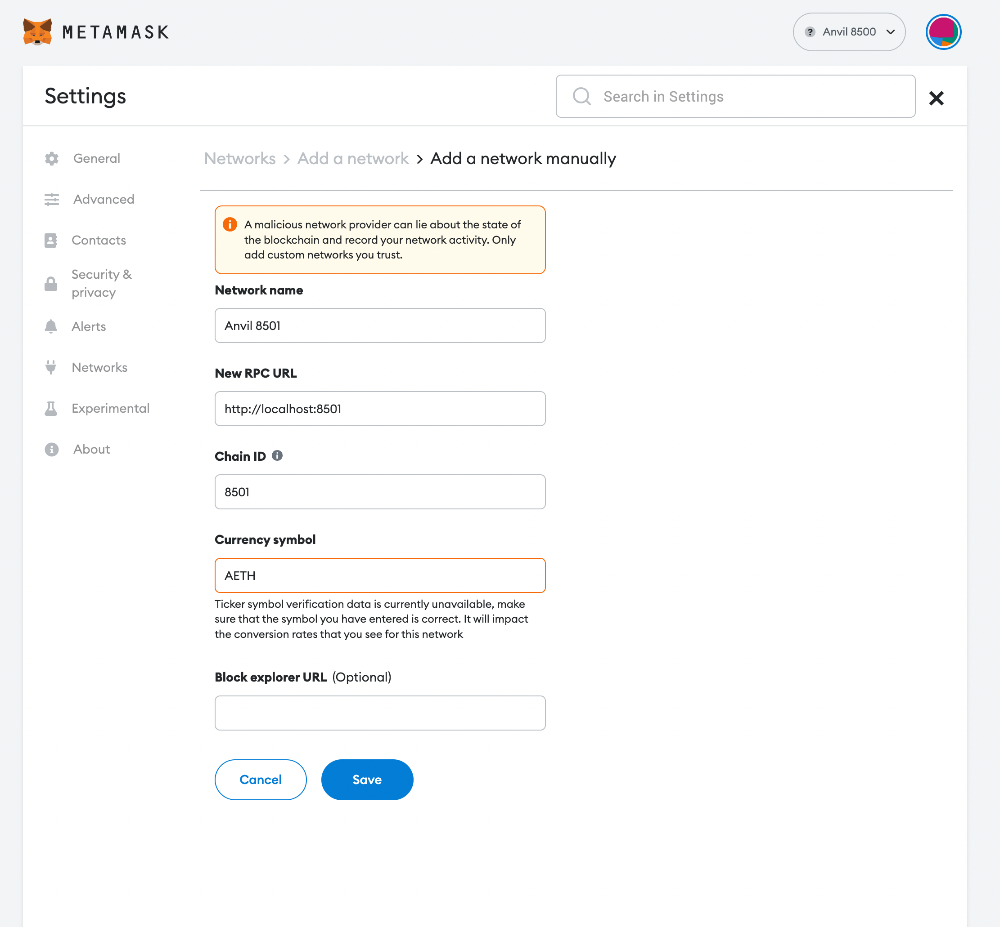

# Contracts
## Deployments
- Sepolia: `0x4ed9c70E9A5C6a116365EB8A9e2cf442dECA71C7`
- Goerli: `0xc638f625aC0369d56D55106affbD5b83872Db971`
## Compile
`npx hardhat compile`

## Test
`npx hardhat test`

## Collect using CLI
*Ideally use the UI for collection, but if you'd like to use cmd, run the command below.*
`ts-node ./scripts/collect.ts --pk=<collection private key> --rpc=<rpc for relevant chain> --contract_address=<Collector contract address> --leaves_file=<Merkle tree leaves file path>`

## Deploy (using gcloud KMS)
1. Set up environment variables for:
    - `ALCHEMY_API_KEY`
    - `GOOGLE_APPLICATION_CREDENTIALS` ([details](https://cloud.google.com/docs/authentication/application-default-credentials#GAC))
    - `KMS_PROJECT_ID`
    - `KMS_LOCATION_ID`
    - `KMS_KEYRING_ID`
    - `KMS_KEY_ID`
    - `KMS_KEY_VERSION`
2. `ts-node ./scripts/deploy-kms.ts --network=goerli --amount=10000000000 --leaves_file=./data/mt.txt`

There are two optional cmd flags: `graffiti` / `recipient`

## Dev workflow (UI testing)
1. Set up environment variable for `DEV_WALLETS` (comma separated list of public keys)
2. Fill out `local-mt.txt` with some public keys for claiming
3. Add `Anvil 8500` and `Anvil 8501` networks to wallet
4. `yarn start-local` – spins up 2 anvil nodes at 8500 and 8501 for testing dual network.

## metamask local net setup

## Generate tree
- `ts-node ./scripts/generate-tree`
